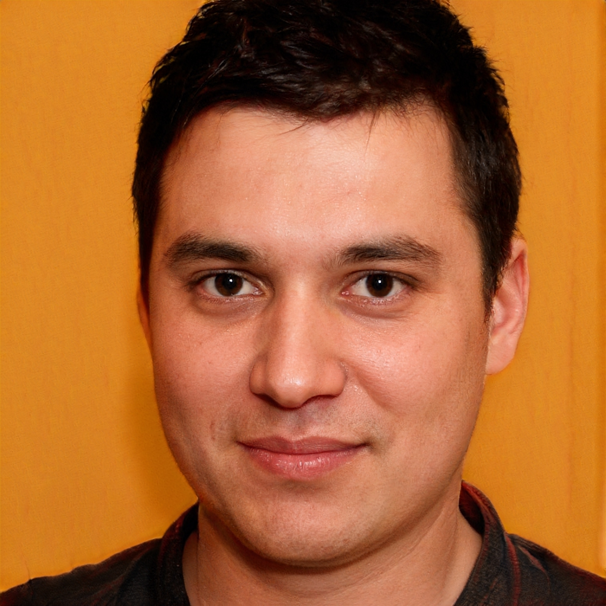

# Personas

## Introdução

&nbsp;&nbsp;Uma persona é um personagem fictício, arquétipo hipotético de um grupo de usuários reais, criada para descrever um usuário típico, é utilizada principalmente para representar um grupo de usuários finais durante discussões de design, mantendo todos focados no mesmo alvo.
 
&nbsp;&nbsp;Elas serão utilizadas posteriormente na etapa de elicitação de requisitos pelo método da introspecção.

 

## Persona 1

| Persona | Vitor Araújo Gonçalves|
|--|--|
| Status: | Persona primária |
| Nome: | Vitor Araújo Gonçalves |
| Foto: |  |
| Idade: | 33 anos. |
| Profissão: | Arquiteto. |
| Escolaridade: | Ensino superior completo. |
| Objetivos: | Economizar dinheiro, não ficar entediado, tornar-se especialista em paisagismo. |
| Habilidades: | Inovação e criatividade, humilde, tende a melhorar-se como pessoa, sabe tocar violão e competitividade. |
| Relacionamentos: | Encontra-se em um noivado com Laura Cavalcanti Sousa, não pretende ter filhos. |
| Requisitos: | Todo projeto que ele inicia ele precisa recomendar bons itens de decoração para seus clientes. |
| Tarefas: | Procura itens de decoração, sempre revisa seus designs procurando melhorá-los. |
| Expectativas: | Espera que o produto contenha as melhores promoções das lojas, além do mais, acredita que as promoções não sejam falsas.  Pretende recomendar o aplicativo para seus clientes. |

[//]: # (Lembrar de arrumar o tamanho da imagem)

  

## Persona 2

| Persona | Kelly Takashi Carvalho |
|--|--|
| Status: | Stakeholder |
| Nome: | Kelly Takashi Carvalho |
| Foto: |  |
| Idade: | 27 anos |
| Profissão: | Atriz |
| Escolaridade: | Ensino médio completo. |
| Objetivos: | Ganhar um Oscar, ajudar outras atrizes a conquistarem seu espaço no mundo cinematográfico, se divertir, conseguir passar mais tempo com a família e viajar o mundo |
| Habilidades: | Criatividade, extrovertida, altruísta, habilidade de palco, carinhosa. |
| Relacionamentos: | Viúva, mãe solteira de uma filha, casada com o trabalho. |
| Requisitos: | Precisa aliviar sua rotina sempre que pode. |
| Tarefas: | Passa a maior parte do dia ensaiando com o resto do elenco, visita a filha, que mora com os avós,sempre que tem tempo disponível em sua agenda. |
| Expectativas: | Viciada em fazer compras, espera encontrar boas promoções tanto de produtos para si mesma como presentes para familiares e amigos. |

  

## Persona 3

| Persona | Rafael Azevedo Martins |
|--|--|
| Status: | Antiusuário |
| Nome: | Rafael Azevedo Martins |
| Foto: |  |
| Idade: | 57 anos |
| Profissão: | Professor universitário |
| Escolaridade: | Mestrado |
| Objetivos: | Realizar um doutorado em economia, se tornar o melhor profissional do pais, se tornar influente na economia brasilieira |
| Habilidades: | Economia internacional e agroindustrial, toca piano, lê livros ao contrário |
| Relacionamentos: | Solteiro, tentando encontrar sua alma gêmea |
| Requisitos: | Em toda pesquisa que ele participa tende a dar sua opinião ao máximo |
| Tarefas: | Durante seu dia passa a maior parte do seu tempo se dedicando a rede socias para se tornar mais visado dentro de sua área, sai a noite para eventos sociais em busca de novas relações socias |
| Expectativas: | Gosta de fazer compras em loja fisico, não confia em comprar online pois tem medo de sofrer algum golpe, tenta evitar comprar o máximo possível para economizar dinheiro |

  

## Versionamento
| Versão | Data | Modificação | Autor |
|--|--|--|--|
| 1.0 | 16/09/2020 | Criação da estrutura base do documento de personas | Rhuan Carlos e Marcelo Victor |
| 2.0 | 19/09/2020 | Criação da 1ª e 2ª personas, Vitor Gonçalves e Kelly Takashi | Rhuan Carlos e Thiago Guilherme |
| 3.0 | 19/09/2020 | Criação da 3ª persona, Rafael Azevedo | Marcelo Victor |
| 3.1 | 20/09/2020 | Correções gerais | Marcelo Victor e Rhuan Carlos |