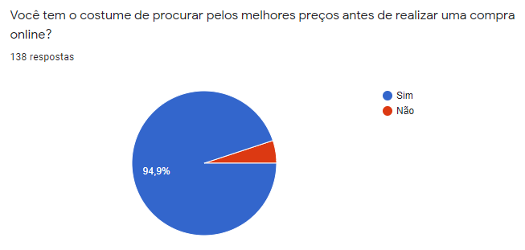
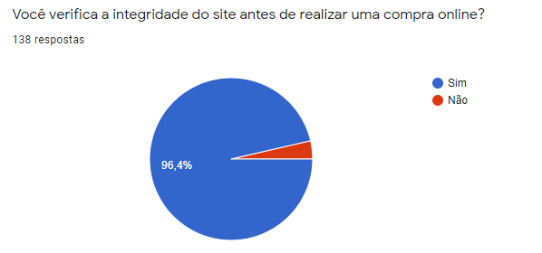

# Questionário

## Qual o motivo de utilizarmos essa técnica de elicitação?

O principal motivo de utilizarmos a técnica de questionário foi devido ao seu baixo custo atrelado à uma quantidade de respostas razoável, além de tornar possível a obtenção de respostas de diversos possíveis usuários em posições geográficas diferentes e a partir disso, elicitar os requisitos de acordo com suas respostas.

Num período de pandemia como esse, a técnica de questionários se faz ainda mais importante, visto que qualquer outra técnica de elicitação que envolvesse o encontro com pessoas se torna inviável devido ao isolamento social.

## O que esperamos com esse questionário?

Esperamos obter dados quantitativos e também a opinião das pessoas em relação ao nicho do app (Promobit). Com a interpretação desses dados esperamos obter alguns requisitos.

## Metodologias e técnicas utilizadas

Nós pensamos sobre o intuito do questionário e levantamos as seguintes questões para começarmos a criá-lo:

- O que procuramos saber com esse questionário?
- Qual o nosso objetivo com ele?
- Quem é o público-alvo desse questionário?
- Será avaliado estatisticamente?
- Como distribuiremos esse questionário?
- O número estimado de respostas é suficiente para o tipo de análise que queremos realizar?

Com a resposta dessas questões em mente e seguindo as dicas para criação de um questionário (WIEGERS, BEATTY. 2013), escrevemos as questões (que serão listadas abaixo). E para ordenar as perguntas de forma que o usuário não se canse e forneça boas respostas, utilizamos a estrutura de questionário diamante (VAZQUEZ, SIVÕES. 2016).

## Resultados do questionário

Os resultados obtidos com o questionários são listados abaixo

### Questão 1

### Questão 2

### Questão 3

### Questão 4

### Questão 5

### Questão 6

### Questão 7

### Questão 8

### Questão 9

### Questão 10

## Requisitos elicitados

|Número | Requisito | Tipo |
|:--:|--|:--:|
| 1 | Validação de ofertas e cupons sugeridos | Funcional |
| 2 | Possuir um fórum interativo para os usuários | Funcional |
| 3 | Criar uma lista de desejos | Funcional |
| 4 | Visualizar avaliação de outros usuários | Funcional |
| 5 | Avaliar produtos e ofertas cadastrados | Funcional |
| 6 | Filtrar cupons por lojas | Funcional |
| 7 | Possuir um sistema de gamificação | Não funcional |
| 8 | A oferta deverá ser de uma loja confiável | Não funcional |
| 9 | Parceria com lojas confiáveis | Não funcional |
| 10 | A interface deverá ter boa usabilidade | Não funcional |

## Referências

>VAZQUEZ, Carlos; SIVÕES, Guilherme. "Engenharia de Requisitos". Brasport Livros e Multimídia Ltda, 2016.

>WIEGERS, Karl; BEATTY, Joy. "Software Requirements". Microsoft Press, 2013.

## Versionamento
| Versão | Data | Modificação | Autor |
|--|--|--|--|
| 0.1 | 20/09/2020 | Criação do documento | Igor Paiva e Thiago Lopes |
| 1.0 | 23/09/2020 | Adição dos resultados e requisitos elicitados | Igor Paiva e Thiago Lopes |
