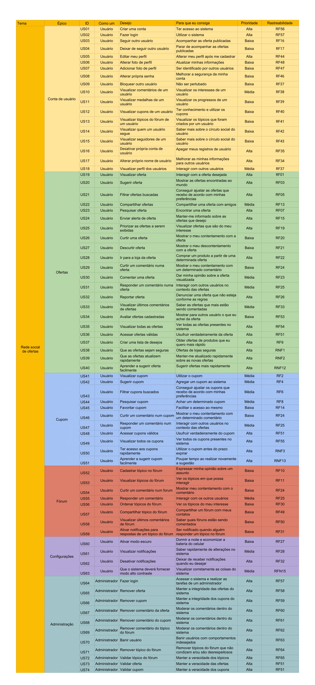

# Backlog do produto

## Introdução

O backlog de produto em um projeto ágil contém uma lista de demandas de trabalho que um time deve realizar. São normalmente compostos de histórias de usuário, mas alguns times também colocam outros requisitos, processos de negócio, e defeitos a serem corrigidos (Wiegers e Beatty, 2013).

## Backlog

A planilha com o backlog pode ser encontrada <a href="https://docs.google.com/spreadsheets/d/1ecDGhmgEEUVa-CTc9aWJFQeixfmceMiSLAPMyHQI3SY/edit?usp=sharing" target="_blank">aqui</a>

## História de usuário

Uma história de usuário é uma curta e simples descrição de uma tarefa expressa na perspectiva da pessoa que deseja essa nova funcionalidade, normalmente um usuário ou cliente do sistema (Wiegers e Beatty, 2013).

Serão escritos da seguinte forma:
 
 
Eu, como um < TIPO DE USUÁRIO >, desejo < OBJETIVO > para que eu consiga < UMA RAZÃO >

### EP01: Conta de usuário

#### US01: Criar uma conta

Eu, como um usuário, desejo criar uma conta para que eu consiga ter acesso ao sistema

Critérios de aceitação

* Deve conter um botão de criar conta promobit para entrar na página
* Deve apresentar áreas para preenchimentos dos dados do novo usuário
* Deve realizar conexão com o promobit
* Deve concluir o cadastro salvando os dados do usuário
* Deve apresentar opção de realizar cadastro com conta do Google
* Deve apresentar opção de realizar cadastro com conta do Facebook

#### US02: Fazer login

Eu, como um usuário, desejo fazer login para que eu consiga utilizar o sistema

Critérios de aceitação

* Deve conter um botão de realizar login no promobit para entrar no sistema
* Deve realizar conexão com o promobit
* Deve apresentar áreas para preenchimento dos dados do usuário
* Deve apresentar opção de realizar login com conta do Google
* Deve apresentar opção de realizar login com conta do Facebook

#### US03: Seguir outro usuário

Eu, como um usuário, desejo seguir outro usuário para que eu consiga acompanhar as oferta publicadas

Critérios de aceitação

* Deve conter um botão para seguir um usuário no promobit
* Deve realizar conexão com o promobit
* Deve mostrar um feedback ao usuário
* Deve salvar a opção do usuário

#### US04: Deixar de seguir outro usuário 

Eu, como um usuário, desejo deixar de seguir outro usuário para que eu consiga parar de acompanhar as ofertas publicadas

Critérios de aceitação

* Deve conter um botão para deixar de seguir um usuário no promobit
* Deve realizar conexão com o promobit
* Deve mostrar um feedback ao usuário
* Deve salvar a opção do usuário

#### US05: Editar meu perfil

Eu, como um usuário, desejo editar meu perfil para que eu consiga alterar meu perfil após me cadastrar

Critérios de aceitação

* Deve conter um botão "Editar Perfil" na sessão de configuração de perfil de usuário
* Deve conter uma página com todas as opções de edição de perfil possíveis ao usuário
* Deve realizar conexão com o promobit
* Deve conter um botão de salvar alterações
* Deve concluir a edição salvando os novos dados do usuário

#### US06: Alterar foto de perfil

Eu, como um usuário, desejo alterar foto de perfil para que eu consiga atualizar minhas informações

Critérios de aceitação

* Deve conter um botão na foto atual do usuário
* Deve apresentar opções de local de seleção da foto desejada
* Deve realizar conexão com o promobit
* Deve conter um botão de salvar alterações
* Deve concluir a edição salvando a nova foto do usuário

#### US07: Adicionar foto de perfil

Eu, como um usuário, desejo adicionar foto de perfil para que eu consiga ser identificado por outros usuários

Critérios de aceitação

* Deve conter um botão no local da foto do usuário
* Deve apresentar opções de local de seleção da foto desejada
* Deve realizar conexão com o promobit
* Deve conter um botão de salvar alterações
* Deve concluir a edição salvando a nova foto do usuário

#### US08: Alterar própria senha

Eu, como um usuário, desejo alterar própria senha para que eu consiga melhorar a segurança da minha conta

Critérios de aceitação

* Deve conter um botão "Alterar senha" na sessão de configuração de perfil de usuário
* Deve conter uma página pedindo um campo de inserção de senha antiga por segurança, e um campo de nova senha
* Deve realizar conexão com o promobit
* Deve verificar se a senha antiga inserida corresponde à senha salva pelo sistema
* Deve salvar a nova senha do usuário

#### US09: Bloquear outro usuário

Eu, como um usuário, desejo bloquear outro usuário para que eu consiga não ser pertubado

Critérios de aceitação

* Deve conter um botão "Bloquear" no perfil do usuário
* Deve mostrar um feedback para o usuário
* As publicações do usuário bloqueado não devem aparecer para quem o bloqueou

#### US10: Visualizar comentários de um usuário

Eu, como um usuário, desejo visualizar comentários de um usuário para que eu consiga visualizar os interesses de um usuário

Critérios de aceitação

* Deve conter um campo específico para comentários
* Deve ser possível responder a um comentário
* Deve ser possível curtir um comentário
* Deve ser possível reportar um comentário

#### US11: Visualizar medalhas de um usuário

Eu, como um usuário, desejo visualizar medalhas de um usuário para que eu consiga visualizar os progressos de um usuário

Critérios de aceitação

* Deve conter um local específico para exibir as medalhas do usuário

#### US12: Visualizar cupons de um usuário

Eu, como um usuário, desejo visualizar cupons de um usuário para que eu consiga ter conhecimento e utilizar os cupons

Critérios de aceitação

* Deve conter um local específico para exibir os cupons do usuário

#### US13: Visualizar tópicos do fórum de um usuário

Eu, como um usuário, desejo visualizar tópicos do fórum de um usuário para que eu consiga visualizar os tópicos que foram criados por um usuário

Critérios de aceitação

* Deve conter um local específico para exibir os tópicos do fórum de um usuário
* Deve ser possível selecionar e abrir um tópico do fórum de um usuário

#### US14: Visualizar quem um usuário segue

Eu, como um usuário, desejo visualizar quem um usuário segue para que eu consiga saber mais sobre o círculo social do usuário

Critérios de aceitação

* Deve conter um local específico para exibir quem um usuário segue
* Deve ser possível selecionar e abrir o perfil de quem o usuário segue

#### US015: Visualizar seguidores de um usuário

Eu, como um usuário, desejo visualizar seguidores de um usuário para que eu consiga saber mais sobre o círculo social do usuário

Critérios de aceitação

* Deve conter um campo com os perfis que o usuário visualizado segue
* Deve ter um botão que redirecione o usuário para as informações do usuário selecionado

#### US16: Desativar própria conta de usuário

Eu, como um usuário, desejo desativar própria conta de usuário para que eu consiga apagar meus registros de usuário

Critérios de aceitação

* Deve conter um botão para desativar a conta
* Deve ter um feedback validando o desejo de desativar a conta

#### US17: Alterar próprio nome de usuário

Eu, como um usuário, desejo alterar próprio nome de usuário para que eu consiga melhorar as minhas informações para outros usuários

Critérios de aceitação

* Deve conter um campo para preencher um novo nome
* Deve conter um botão para alterar o nome
* Deve ter um feedback validando o desejo de alterar o nome

#### US18: Visualizar perfil dos usuários

Eu, como um usuário, desejo visualizar perfil dos usuários para que eu consiga interagir com outros usuários

Critérios de aceitação

* Deve conter um campo com os perfis dos usuários
* Deve ter um botão que redirecione o usuário para as informações do usuário selecionado

### EP02: Ofertas

#### US19: Visualizar oferta

Eu, como um usuário, desejo visualizar oferta para que eu consiga interagir com a oferta desejada

Critérios de aceitação

* Deve conter o botão de criar conta promobit para entrar na pagina
* Deve apresentar áreas para preenchimentos dos dados do novo usuário
* Deve realizar conexão com o promobit
* Deve concluir o cadastro salvando os dados do usuário

#### US20: Sugerir oferta

Eu, como um usuário, desejo sugerir oferta para que eu consiga mostrar as ofertas encontradas ao mundo

Critérios de aceitação

* Deve conter um botão de adicionar na página de ofertas
* Deve apresentar áreas para preenchimentos dos dados de uma oferta
* Deve conter de conter um botão para enviar a oferta

#### US21: Filtrar ofertas buscadas

Eu, como um usuário, desejo filtrar ofertas buscadas para que eu consiga conseguir ajustar as ofertas que recebo de acordo com minhas preferências

Critérios de aceitação

* Deve conter um botão de filtrar ofertas na página de ofertas
* Deve apresentar as categorias disponíveis
* Deve conter um botão de aplicar filtro

#### US22: Compartilhar ofertas

Eu, como um usuário, desejo compartilhar ofertas para que eu consiga compartilhar uma oferta com amigos

Critérios de aceitação

* Deve conter o botão de compartilhar oferta na página da oferta
* Deve apresentar opções de aplicativos do usuário para compartilhação
* Deve apresentar um link para a oferta

#### US23: Pesquisar oferta

Eu, como um usuário, desejo pesquisar oferta para que eu consiga encontrar uma oferta

Critérios de aceitação

* Deve uma barra de pesquisa com um campo de texto
* Deve apresentar produtos e ofertas mais buscados
* Deve possuir opções de ordenação
* Deve listar as ofertas encontradas

#### US24: Enviar alerta de oferta

Eu, como um usuário, desejo enviar alerta de oferta para que eu consiga manter-me informado sobre as ofertas que desejo

Critérios de aceitação

* Deve conter um serviço de notificação
* O usuário deve ser notificado de ofertas de produtos ou categorias que ele tenha cadastrado

#### US25: Priorizar as ofertas a serem exibidas

Eu, como um usuário, desejo priorizar as ofertas a serem exibidas para que eu consiga visualizar ofertas que são do meu interesse

Critérios de aceitação

* Deve existir um perfil do usuário para que o feed de ofertas seja direcionado ao seu perfil
* Ao listar as ofertas elas devem ser ordenadas de acordo com o perfil do usuário

#### US26: Curtir uma oferta

Eu, como um usuário, desejo curtir uma oferta para que eu consiga mostrar o meu contentamento com a oferta

Critérios de aceitação

* Deve conter um botão de curtir na página da oferta
* Após clicado o usuário deve ser informado que a oferta foi curtida

#### US27: Descurtir oferta

Eu, como um usuário, desejo descurtir oferta para que eu consiga mostrar o meu descontentamento com a oferta

Critérios de aceitação

* Após ter curtido uma oferta ao clicar no botão de curtir a oferta deve ser descurtida
* Após clicado o usuário deve ser informado que a oferta foi descurtida

#### US28: Ir para a loja da oferta

Eu, como um usuário, desejo ir para a loja da oferta para que eu consiga comprar um produto a partir de uma determinada oferta

Critérios de aceitação

* Deve conter um botão na página da oferta que ao ser clicado redireciona o usuário para a página da loja

#### US29: Curtir um comentário numa oferta

Eu, como um usuário, desejo curtir um comentário numa oferta para que eu consiga mostrar o meu contentamento com um determinado comentário

Critérios de aceitação

* Deve conter um botão de curtir nos comentários
* Após clicado o usuário deve ser informado que o comentário foi curtido

#### US30: Comentar uma oferta

Eu, como um usuário, desejo comentar uma oferta para que eu consiga dar minha opinião sobre a oferta visualizada

Critérios de aceitação

* Deve conter um campo de texto na página da oferta para o usuário inserir um comentário
* Deve conter um botão de enviar o comentário inserido

#### US31: Responder um comentário numa oferta

Eu, como um usuário, desejo responder um comentário numa oferta para que eu consiga interagir com outros usuários no contexto das ofertas

Critérios de aceitação

* Deve conter um botão de resposta em cada comentário de uma oferta
* Ao ser clicado um campo de texto para a resposta deve ser mostado
* Deve conter um botão de enviar o comentário

#### US32: Reportar oferta

Eu, como um usuário, desejo reportar oferta para que eu consiga denunciar uma oferta que não esteja conforme as regras

Critérios de aceitação

* Deve conter um botão de reportar na página da oferta
* Ao ser clicado deve ser apresentada opções para a razão do denúncia
* Ao submeter o usuário deve ser informado que a denúncia foi realizada

#### US33: Visualizar últimos comentários de ofertas

Eu, como um usuário, desejo visualizar últimos comentários de ofertas para que eu consiga saber as ofertas que mais estão sendo comentadas

Critérios de aceitação

* Deve conter um botão para visualizar os últimos comentários de ofertas
* Deve conter uma lista com os últimos comentários de ofertas

#### US34: Avaliar ofertas cadastradas

Eu, como um usuário, desejo avaliar ofertas cadastradas para que eu consiga mostrar para outros usuário o que eu achei da oferta

Critérios de aceitação

* Deve conter um campo para preencher a opinião do usuário sobre a oferta

#### US35: Visualizar todas as ofertas

Eu, como um usuário, desejo visualizar todas as ofertas para que eu consiga ver todas as ofertas presentes no sistema

Critérios de aceitação

* Deve conter uma lista de ofertas

#### US36: Acessar ofertas válidas

Eu, como um usuário, desejo acessar ofertas válidas para que eu consiga usufruir verdadeiramente da oferta

Critérios de aceitação

* Deve ter um icone indicando que a oferta é valida

#### US37: Criar uma lista de desejos

Eu, como um usuário, desejo criar uma lista de desejos para que eu consiga obter ofertas de produtos que eu quero mais rápido

Critérios de aceitação

* Deve conter o botão de lista de desejos
* Deve conter um campo para preencher um desejo
* Deve conter o botão de adicionar um desejo

#### US38: Que as ofertas sejam seguras

Eu, como um usuário, desejo que as ofertas sejam seguras para que eu consiga ofertas de lojas seguras

Critérios de aceitação

* Deve ter um icone indicando que a oferta é segura

#### US39: Que as ofertas atualizem rapidamente

Eu, como um usuário, desejo que as ofertas atualizem rapidamente para que eu consiga manter-me atualizado rapidamente sobre as novas ofertas

Critérios de aceitação

* Deve ser dinâmico e veloz a atualização da lista de ofertas

#### US40: Aprender a sugerir oferta facilmente

Eu, como um usuário, desejo aprender a sugerir oferta facilmente para que eu consiga sugerir ofertas mais rapidamente

Critérios de aceitação
* Deve ter cores intuitivas dentro do contexto de ações de sugerir uma oferta
* Deve ter frases que expressam de forma clara o interesse de sugerir uma oferta

### EP03: Cupom

#### US41: Visualizar cupom

Eu, como um usuário, desejo visualizar cupom para que eu consiga utilizar o cupom

Critérios de aceitação

* Deve conter um cupom
* Deve ter um nome par o cupom
* Deve ter como favoritar um cupom
* Deve ter as instruções do cupom
* Deve ter uma foto do cupom
* Deve ter como compartilhar o cupom
* Deve conter o link do cupom

#### US42: Sugerir cupom

Eu, como um usuário, desejo sugerir cupom para que eu consiga agregar um cupom ao sistema

Critérios de aceitação

* Deve conter o botão de sugerir um cupom
* Deve ter como descrever o cupom
* Deve ter como preencher o código do cupom
* Deve ter como escrever as regras do cupom
* Deve ter como escrever o link do cupom
* Deve ter como selecionar a loja do cupom

#### US43: Filtrar cupons buscados

Eu, como um usuário, desejo filtrar cupons buscados para que eu consiga conseguir ajustar os cupons que recebo de acordo com minhas preferências

Critérios de aceitação

* Deve conter o botão de filtrar um cupom
* Deve ter como selecionar palavras chaves para filtrar o cupom
* Deve ter como escrever uma palavra chave para filtrar o cupom

#### US44: Pesquisar cupom

Eu, como um usuário, desejo pesquisar cupom para que eu consiga achar um determinado cupom

Critérios de aceitação

* Deve conter um local para preencher o cupom que será pesquisado
* Deve ter como ter um botão para buscar o cupom descrito

#### US45: Favoritar cupom

Eu, como um usuário, desejo favoritar cupom para que eu consiga facilitar o acesso ao mesmo

Critérios de aceitação

* Deve conter o botão de favoritar
* O botão de favoritar deve mudar de cor

#### US46: Curtir um comentário num cupom

Eu, como um usuário, desejo curtir um comentário num cupom para que eu consiga mostrar o meu contentamento com um determinado comentário

Critérios de aceitação

* Deve conter um comentário no cupom
* Deve conter o botão de curtir um cupom
* O botão de curtir deve mudar de cor

#### US47: Responder um comentário num cupom

Eu, como um usuário, desejo responder um comentário num cupom para que eu consiga interagir com outros usuários no contexto das ofertas

Critérios de aceitação

* Deve conter um campo para preencher um comentário num cupom
* Deve conter um botão para enviar o comentário preenchido

#### US48: Acessar cupons válidos

Eu, como um usuário, desejo acessar cupons válidos para que eu consiga usufruir verdadeiramente do cupom

Critérios de aceitação

* Deve ter um icone de validação do cupom

#### US49: Visualizar todos os cupons

Eu, como um usuário, desejo visualizar todos os cupons para que eu consiga ver todos os cupons presentes no sistema

Critérios de aceitação

* Deve conter uma lista de cupons

#### US50: Ter acesso aos cupons rapidamente

Eu, como um usuário, desejo ter acesso aos cupons rapidamente para que eu consiga utilizar o cupom antes do prazo expirar

Critérios de aceitação

* Deve ser dinâmico e veloz a atualização da lista de cupons

#### US51: Aprender a sugerir cupom facilmente

Eu, como um usuário, desejo aprender a sugerir cupom facilmente para que eu consiga poupar tempo ao realizar novamente a sugestão

Critérios de aceitação

* Deve ter cores intuitivas dentro do contexto de ações de sugerir um cupom
* Deve ter frases que expressam de forma clara o interesse de sugerir um cupom

### EP04: Fórum

#### US52: Cadastrar tópico no fórum

Eu, como um usuário, desejo cadastrar tópico no fórum para que eu consiga expressar minha opinião sobre um assunto

Critérios de aceitação

* Deve a seção de cadastrar tópicoconter os campos a serem preenchidos* Deve realizar conexão com o promobit
* Deve enviar os dados corretamente para a avaliação
* Deve conter um botão para confirmar o cadastroter um botão para criar um novo tópico
* Deve conter um campo para inserir um titulo no tópico
* Deve ter um campo para escrever sobre o tópico
* Deve ter como selecionar a categoria do tópico
* Deve ter um botão para enviar o tópico
* Deve ter um feedback validando o interesse de criar um novo tópico

#### US53: Visualizar tópicos do fórum

Eu, como um usuário, desejo visualizar tópicos do fórum para que eu consiga ver os tópicos em que possa interagir

Critérios de aceitação

* Deve conter uma seção contendo os tópicos do fórum
* Deve atualizar dinamicamente a seção
* Deve permitir a rolagem entre os tópicos listados

#### US54: Curtir um comentário

Eu, como um usuário, desejo curtir um comentário num forum para que eu consiga mostrar meu contentamento com o comentário

Critérios de aceitação

* Deve conter o ícone de curtir o comentário
* Deve alterar o estado do ícone
* Deve realizar conexão com o promobit

#### US55: Responder um comentário

Eu, como um usuário, desejo responder um comentário para que eu consiga interagir com os outros usuários

Critérios de aceitação

* Deve conter uma *box* para comentar
* Deve apresenta uma área para preenchimento do texto
* Deve concluir a operação enviando e publicando o comentário
* Deve conter um botão para adicionar imagem
* Deve conter um botão para alterar o tipo de texto, itálico, negrito
* Deve conter um botão para concluir a ação

#### US56: Ordenar tópicos do fórum

Eu, como um usuário, desejo ordenar tópicos do fórum para que eu consiga ver os tópicos do meu interesse

Critérios de aceitação

* Deve conter uma seção contendo critérios de ordenação
* Deve conter um botão confirmando a ordenação

#### US57: Compartilhar tópico do fórum

Eu, como um usuário, desejo compartilhar tópico do fórum para que eu consiga compartilhar um fórum com meus contatos

Critérios de aceitação

* Deve conter o botão de compartilhar tópico
* Deve conectar corretamente com outros aplicativos

#### US58: Visualizar últimos comentários de fórum

Eu, como um usuário, desejo visualizar últimos comentários de fórum para que eu consiga saber quais fóruns estão sendo comentados

Critérios de aceitação

* Deve conter uma seção com os últimos comentários
* Deve atualizar dinamicamente a seção
* Deve permitir a rolagem entre os comentários listados

#### US59: Ativar notificações para respostas de um tópico do fórum

Eu, como um usuário, desejo ativar notificações para respostas de um tópico do fórum para que eu consiga ser notificado quando alguém responder um tópico no fórum

Critérios de aceitação

* Deve conter um botão de ativar as notificações dentro da seção do tópico
* Deve fornecer um serviço de notificação

### EP05: Configurações

#### US60: Ativar modo escuro

Eu, como um usuário, ativar modo escuro desejo para que eu consiga dormir a noite e economizar a bateria do celular

Critérios de aceitação

* Deve conter um botão de ativar modo escuro
* Deve informar que as alterações podem ser revertidas a qualquer momento
* Deve salvar as configurações de forma local corretamente

#### US61: Visualizar notificações

Eu, como um usuário, desejo visualizar notificações para que eu consiga saber rapidamente de alterações no sistema

Critérios de aceitação

* Deve conter uma seção para configurar as notificações
* Deve conter um botão de ativar notificações
* Deve conter um serviço de notificação
* Deve notificar corretamente o usuário

#### US62: Desativar notificações

Eu, como um usuário, desejo desativar notificações para que eu consiga deixar de receber notificações quando eu desejar

Critérios de aceitação

* Deve conter o botão de desativar notificações
* Deve apresentar uma seção para escolher quais tipos de notificação devem ser alterados
* Deve salvar as configurações de forma local corretamente

#### US63: O sistema deverá fornecer modo alto contraste

Eu, como um usuário, desejo que o sistema deverá fornecer modo alto contraste para que eu consiga visualizar corretamente as coisas do sistema

Critérios de aceitação

* Deve conter o botão para alternar para modo alto contraste
* Deve informar que as alterações podem ser revertidas a qualquer momento
* Deve salvar as configurações de forma local corretamente

### EP06: Administração

#### US64: Fazer login

Eu, como um administrador, desejo fazer login para que eu consiga acessar o sistema e realizar as tarefas de um administrador

Critérios de aceitação

* Deve conter um botão de realizar login no promobit
* Deve realizar conexão com o promobit
* Deve apresentar áreas para preenchimento dos dados do usuário

#### US65: Remover oferta

Eu, como um administrador, desejo remover oferta para que eu consiga manter a integridade das ofertas do sistema

Critérios de aceitação

* Deve conter o botão de remover uma determinada oferta
* Deve requerir uma confirmação de operação

#### US66: Remover cupom

Eu, como um administrador, desejo remover cupom para que eu consiga manter a integridade dos cupons do sistema

Critérios de aceitação

* Deve conter o botão de remover um determinado cupom
* Deve requerir uma confirmação de operação

#### US67: Remover comentário da oferta

Eu, como um administrador, desejo remover comentário da oferta para que eu consiga moderar os comentários dentro do sistema

Critérios de aceitação

* Deve conter o botão de remover comentário de uma oferta
* Deve requerir uma confirmação de operação

#### US68: Remover comentário do cupom

Eu, como um administrador, desejo remover comentário do cupom para que eu consiga moderar os comentários dentro do sistema

Critérios de aceitação

* Deve conter o botão de remover comentário de um cupom
* Deve requerir uma confirmação de operação

#### US69: Remover comentário do tópico do fórum

Eu, como um administrador, desejo remover comentário do tópico do fórum para que eu consiga moderar os comentários dentro do sistema

Critérios de aceitação

* Deve conter o botão de remover comentário de um tópico do fórum
* Deve requerir uma confirmação de operação

#### US70: Banir usuário

Eu, como um administrador, desejo banir usuário para que eu consiga banir usuários com comportamentos indesejados

Critérios de aceitação

* Deve conter o botão de banir usuário do sistema
* Deve requerir uma confirmação de operação
* Deve informar o usuário banido

#### US71: Remover tópico do fórum

Eu, como um administrador, desejo remover tópico do fórum para que eu consiga remover tópicos do fórum que não condizem e/ou são desrespeitosos

Critérios de aceitação

* Deve conter o botão de remover tópico do fórum
* Deve requerir uma confirmação de operação

#### US72: Validar tópico do fórum

Eu, como um administrador, desejo validar tópico do fórum para que eu consiga manter a veracidade dos tópicos

Critérios de aceitação

* Deve conter uma seção com os tópicos a serem validados
* Deve conter o conteúdo do tópico em si
* Deve conter um botão para enviar a validação
* Deve conter informações sobre o tópico

#### US73: Validar oferta

Eu, como um administrador, desejo validar oferta para que eu consiga manter a veracidade das ofertas

Critérios de aceitação

* Deve conter uma seção com as ofertas a serem validados
* Deve conter um link para a página da oferta
* Deve conter um botão para enviar a validação
* Deve conter informações sobre a origem da oferta, quem sugeriu e sobre a oferta em si

#### US74: Validar cupom

Eu, como um administrador, validar cupom desejo para que eu consiga manter a veracidade dos cupons

Critérios de aceitação

* Deve conter uma seção com os cupons a serem validados
* Deve conter um link para a página do cupom
* Deve conter um botão para enviar a validação
* Deve conter informações sobre a origem do cupom, quem sugeriu e sobre o cupom em si

## Referências

>WIEGERS, Karl; BEATTY, Joy. "Software Requirements". Microsoft Press, 2013.

## Versionamento

| Versão | Data | Modificação | Autor |
|--|--|--|--|
| 1.0 | 25/10/2020 | Criação do documento de backlog de produto | Todos os integrantes |
