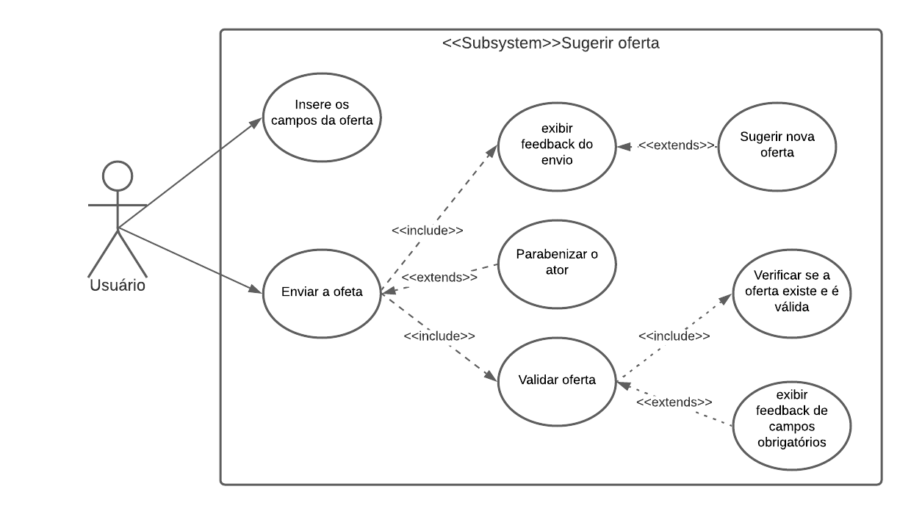
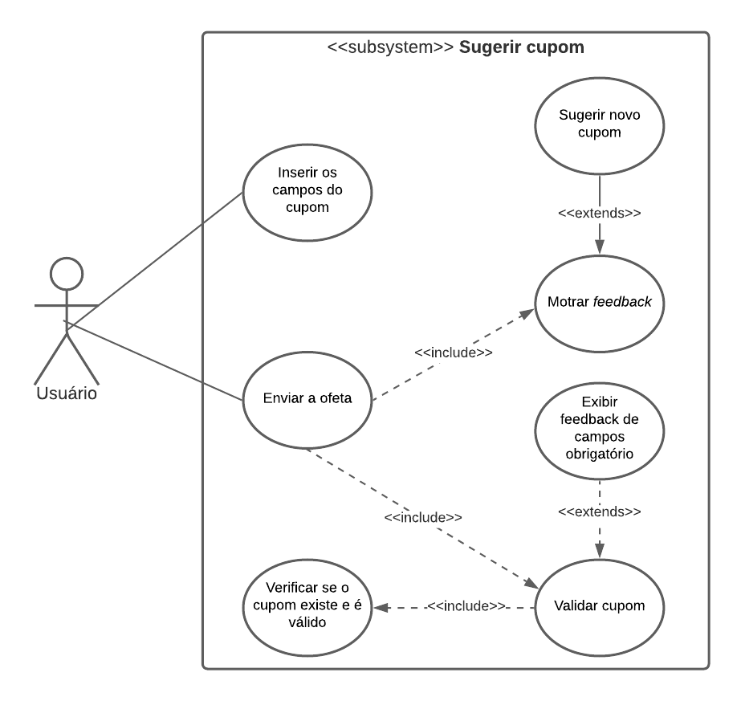
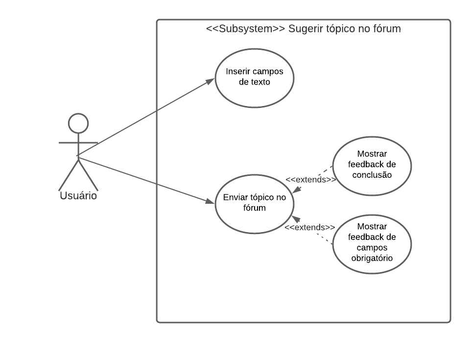
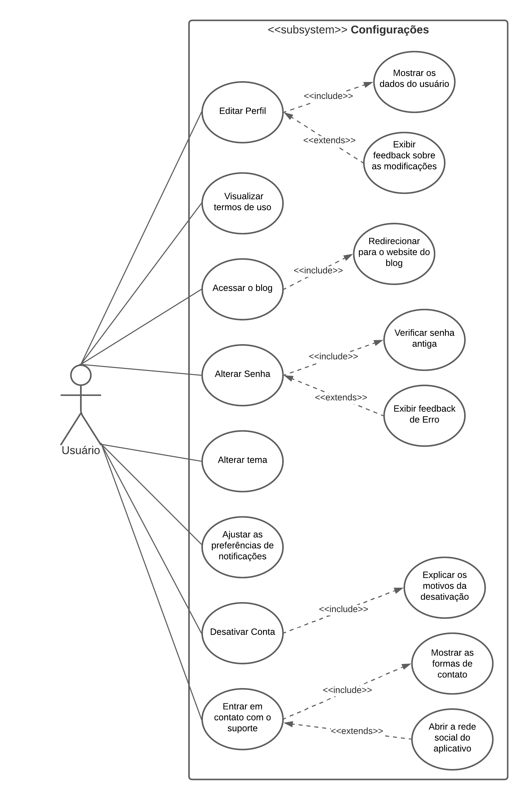
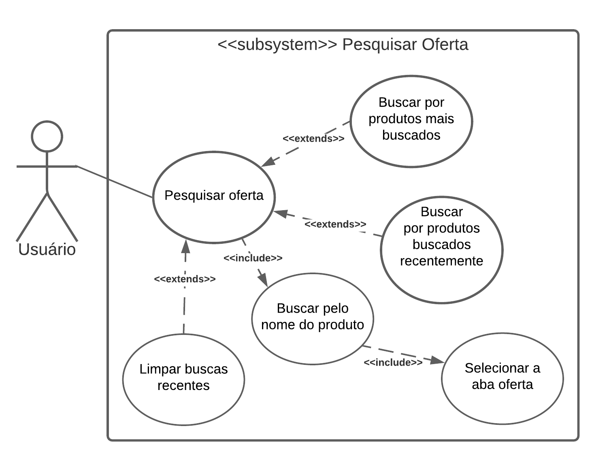
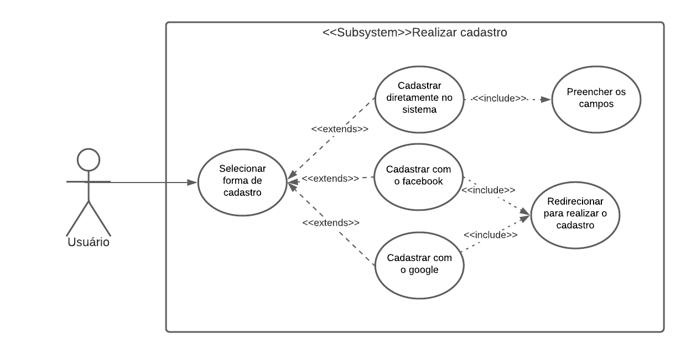

# Casos de uso

## Introdução

Um documento de caso de uso é uma metodologia que descreve como o usuário realizará uma determinada tarefa dentro do contexto de um software. Ele descreve o ponto de vista do usuário e como o sistema responde a partir de suas ações, cada caso de uso é uma sequência de passos que são descritos a partir de fluxos, que começam com um objetivo principal e terminam quando esse objetivo está realizado.

## Casos de Uso

### UC01: Sugerir oferta

<a target="_blank" href="https://drive.google.com/file/d/1dwBC5pR36BVoyWM6lZ7Mv37wBde9F1Hf/view?usp=sharing">Link para o diagrama acima</a>

|         UC01           |                                           Informações                                           |
| :--------------------: | -------------------------------------------------------------------------------------------- |
|       Descrição        | O ato do usuário sugerir uma oferta que poderá ser publica no sistema |
|          Ator(es)      | Usuário |
|   Pré-condições        | O ator deve estar logado, deve estar na seção de ofertas do sistema e deve ter o link de uma oferta |
|    Fluxo principal     | **FP01:**  1. O ator clica no icone de "+"   2. O sistema expõe uma tabela de opções   3. O ator clica em sugerir oferta   4. O sistema redireciona o ator para a seção de sugerir nova oferta   5. O ator preenche os campos de "Link da oferta", "Titulo da oferta", "Preço"   6. O ator coloca uma imagem da oferta no campo de imagem   7. O ator clica no botão "Enviar oferta"   8. O sistema gera um pop-up para o autor com o feedback do envio   9. O ator clica em fechar   10. O ator é redirecionado para a aba de ofertas. |
| Fluxo alternativo      | **FA01:** Fluxo de quando o ator sugeri uma oferta pela primeira vez:  1. O ator clica no icone de "+"   2. O sistema expõe uma tabela de opções   3. O ator clica em sugerir oferta   4. O sistema redireciona o ator para a seção de sugerir nova oferta   5. O ator preenche os campos de "Link da oferta", "Titulo da oferta", "Preço"   6. O ator coloca uma imagem da oferta no campo de imagem   7. O ator clica no botão "Enviar oferta"   8. O sistema gera um pop-up parabenizando o ator pela sua primeira oferta e o premia com uma medalha   9. O ator clica no botão "Fechar"   10. O sistema gera outro pop-up para o autor com o feedback do envio   11. O ator clica em fechar   12. O ator é redirecionado para a aba de ofertas.    **FA02:** Fluxo de quando o ator deseja sugerir uma oferta seguida de uma anterior   1. O ator clica no icone de "+"   2. O sistema expõe uma tabela de opções   3. O ator clica em sugerir oferta   4. O sistema redireciona o ator para a seção de sugerir nova oferta   5. O ator preenche os campos de "Link da oferta", "Titulo da oferta", "Preço"   6. O ator coloca uma imagem da oferta no campo de imagem   7. O ator clica no botão "Enviar oferta"   8. O sistema gera um pop-up para o autor com o feedback do envio   9. O ator clica em "Adicionar outra"   10. O ator é redirecionado para a aba de sugerir oferta.|
|   Fluxo de exceções    | **FE01:** O ator não completa os campos obrigatórios para sugerir a oferta   1. O ator clica no icone de "+"   2. O sistema expõe uma tabela de opções   3. O ator clica em sugerir oferta   4. O sistema redireciona o ator para a seção de sugerir nova oferta   5. O ator não preenche os campos de "Link da oferta", "Titulo da oferta", "Preço"   6. O ator coloca uma imagem da oferta no campo de imagem   7. O ator clica no botão "Enviar oferta"   8. O sistema gera um pop-up alertando o ator sobre a necessidade de preencher o campo obrigatório    **FE02:** Ocorre a perda de conexão durante o uso do aplicativo   1. O ator clica no icone de "+"   2. O sistema expõe uma tabela de opções   3. O ator clica em sugerir oferta   4. O sistema gera um pop-up alertando sobre a impossíbilidade de realizar a ação   5. O ator clica no botão "ok" |
|     Pós condições      | O ator poderá ter uma oferta publicada, também terá a validação do oferta e o ator terá a oferta que sugeriu no seu histórico de ofertas |
|    Rastreabilidade     | Requisito Funcional 3 do documento contendo todos os requisitos - RF3 Sugerir oferta |

### UC02: Sugerir cupom

<a target="_blank" href="https://drive.google.com/file/d/1zAUoT6XMh90Hab5c4NDPnkKojwSVqCsD/view?usp=sharing">Link para o diagrama acima</a>

|         UC01           |                                           Informações                                           |
| :--------------------: | -------------------------------------------------------------------------------------------- |
|       Descrição        | O ato do usuário sugerir um cupom que poderá ser publicado no sistema |
|          Ator(es)      | Usuário |
|   Pré-condições        | O ator deve estar logado, deve estar na seção de "últimos cupons" e "cupons por loja" do sistema e deve ter o link e as informações de um cupom |
|    Fluxo principal     | **FP01:**  1. O ator clica no icone de "+"   2. O sistema expõe uma lista de opções   3. O ator clica em sugerir cupom   4. O sistema redireciona o ator para a seção de sugerir um novo cupom   5. O ator preenche os campos de "Link da cupom", "Descreva o cupom", "Loja", "Código do cupom", "Regras de aplicação"   7. O ator clica no botão "Enviar cupom"   8. O sistema gera um pop-up para o autor com o feedback do envio   9. O ator clica em fechar   10. O ator é redirecionado para a aba de cupons. |
| Fluxo alternativo      | **FA01:** Fluxo de quando o ator deseja sugerir um cupom seguido de um anterior   1. O ator clica no icone de "+"   2. O sistema expõe uma lista de opções   3. O ator clica em sugerir cupom   4. O sistema redireciona o ator para a seção de sugerir um novo cupom   5. O ator preenche os campos de "Link da cupom", "Descreva o cupom", "Loja", "Código do cupom", "Regras de aplicação"   7. O ator clica no botão "Enviar cupom"   8. O sistema gera um pop-up para o autor com o feedback do envio   9. O ator clica em "Adicionar outra"     10. O ator é redirecionado para a aba de cupons. |
|   Fluxo de exceções    | **FE01:** O ator não completa os campos obrigatórios para sugerir o cupom   1. O ator clica no icone de "+"   2. O sistema expõe uma lista de opções   3. O ator clica em sugerir cupom   4. O sistema redireciona o ator para a seção de sugerir um novo cupom   5. O ator preenche os campos de "Link da cupom", "Descreva o cupom", "Loja", "Código do cupom", "Regras de aplicação"   7. O ator clica no botão "Enviar cupom"   8. O sistema gera um pop-up alertando o ator sobre a necessidade de preencher o campo obrigatório    **FE02:** Ocorre a perda de conexão durante o uso do aplicativo   1. O ator clica no icone de "+"   2. O sistema expõe uma lista de opções   3. O ator clica em sugerir cupom   4. O sistema gera um pop-up alertando sobre a impossibilidade de realizar a ação   5. O ator clica no botão "ok" |
|     Pós condições      | O ator poderá ter um cupom publicado, caso esse seja válido, e o ator terá o cupom que sugeriu no seu histórico de cupons |
|    Rastreabilidade     | Requisito Funcional 4 do documento contendo todos os requisitos - RF4 Sugerir cupom |

### UC03: Sugerir tópico no forum

<a target="_blank" href="https://drive.google.com/file/d/1-XXfg-auieUWLq4-1gGUXKMaHHq1MWju/view?usp=sharing">Link para o diagrama acima</a>

|         UC03           |                                           Informações                                           |
| :--------------------: | -------------------------------------------------------------------------------------------- |
|       Descrição        | O ato do usuário sugerir uma oferta que poderá ser publica no sistema |
|       Ator(es)         | Usuário, moderador |
|      Pré-condições     | O ator deve estar logado, e deve estar na seção de fórum do sistema. |
|    Fluxo principal     | **FP01:**   1. O ator clica no icone de "+"   2. O sistema redireciona o ator para a seção de novo tópico no fórum   3. O ator preenche os campos de "Título do fórum", "Categoria do fórum" e "Descrição do tópico"   4. O ator clica no botão "Enviar tópico"   5. O sistema gera um pop-up para o autor com o feedback do envio   6. O ator clica em fechar   7. O ator é redirecionado para a aba de fórum. |
| Fluxo alternativo      | **FA01:** 1. O ator clica no icone de "+"   2. O sistema redireciona o ator para a seção de novo tópico no fórum   3. O ator preenche os campos de "Título do fórum", "Categoria do fórum" e "Descrição do tópico"   4. O ator clica no botão "Enviar tópico"   5. O sistema gera um pop-up para o autor com o feedback do envio   6. O ator clica em "Adicionar outra"   7. O ator é redirecionado para a aba de sugerir oferta.|
|   Fluxo de exceções    | **FE01:**   1. O ator clica no icone de "+"   2. O sistema redireciona o ator para a seção de novo tópico no fórum   3. O ator não preenche um dos campos de "Título do fórum", "Categoria do fórum" ou "Descrição do tópico"   4. O ator clica no botão "Enviar tópico"   5. O sistema alerta o autor sobre a necessidade de inserção de informações do campo obrigatório não preenchido.    **FE02:**   1. O ator clica no icone de "+"   2. O sistema redireciona o ator para a seção de novo tópico no fórum   3. O ator não preenche um dos campos de "Título do fórum", "Categoria do fórum" ou "Descrição do tópico"   4. O ator clica no botão "Enviar tópico"   4. O sistema gera um pop-up alertando sobre a impossíbilidade de realizar a ação   5. O ator clica no botão "ok" |
|     Pós condições      | O ator poderá ter um tópico publicado no fórum caso ele seja aprovado e o ator terá o tópico sugerido em seu histórico de tópicos no fórum |
|    Rastreabilidade     | Requisito Funcional 10 do documento contendo todos os requisitos - RF10 Cadastrar tópico no fórum |

### UC04: Configurações

<a target="_blank" href="https://drive.google.com/file/d/17oPxuo-j3WTpSUXm3ZAIWmdnAj13VY18/view?usp=sharing">Link para o diagrama acima</a>

|         UC04           | Informações |
| :---------: |----------- |
|       Descrição        | O ato do usuário configurar o sistema |
|       Ator(es)         | Usuário |
|   Pré-condições        | O ator deve estar logado |
|    Fluxo principal     | **FP01:** Acessar a aba de configurações  1. O ator deve clicar no icone "☰", no canto superior esquerdo.   2. O ator deve selecionar a opção "⚙ configurações" na aba que foi aberta   3. O sistema exibe as opções de configurações disponíveis. **FP02:** Alterar senha  1. O ator seleciona a opção "Alterar senha".  2. O ator preenche o primeiro campo com a senha atual.  3. O ator preenche o segundo campo com a nova senha. **FP03:** Editar perfil 1. O ator seleciona a opção "Editar perfil". 2. O ator edita os campos referentes aos dados que deseja editar. 3. O ator clica no botão "Salvar". **FP04:** Alterar tema  1. O ator pode clicar no botão de alternância para alternar entre o tema claro e o escuro.  2. O ator pode clicar no botão de alternância para alternar entre o tema atual e o padrão do sistema. **FP05:** Visualizar termos de uso  1. O ator seleciona a opção "Termos de uso". **FP06:** Acessar o blog do aplicativo  1. O ator deve selecionar a opção "Blog do Promobit". **FP07:** Entrar em contato com o suporte  1. O ator deve selecionar a opção "Contato". 2. O ator deve selecionar a forma que deseja usar para entrar em contato com a moderação do sistema. **FP08:** Alterar preferências de notificação 1. O ator pode clicar no botão de alternância para desativar o envio de notificações sobre novas ofertas no celular. 2. O ator deve selecionar a opção "Notificações via e-mail. 3. O ator pode desativar as opções de notificações dos serviços disponíveis. **FP09:** Desativar minha conta  1. O ator deve selecionar a opção "Desativar minha conta".  2. O ator deve confirmar seu desejo clicando em "sim".  3. O ator deve clicar no botão "Continuar". 4. O ator deve selecionar as opções que explicam o que o motivou a desativar a conta. 5. O ator deve clicar em "OK".  5. O ator deve deixar uma mensagem com algum recado ou dica para os moderadores em relação a como podem melhorar o sistema.  6. O ator deve clicar em "Enviar"|
|  Fluxo alternativo     | **FA01:** Acessar a aba de configurações   1. O ator deve clicar no icone " ☰ ", no canto superior esquerdo.   2. O ator deve clicar na sua foto de perfil.   3. O ator deve clicar no icone " ⁝ " no canto superior direito.   4. O sistema exibe as opções de configurações disponíveis. **FA02:** Acessar o blog do aplicativo  1. O ator deve abrir o navegador de sua preferência.  2. O ator deve digitar a url: www.promobit.com.br/blog **FA03:** Entrar em contato via e-mail  1. O ator deve abrir o serviço de e-mail de sua preferência.  2. O ator deve enviar a mensagem para o endereço de e-mail: ola@promobit.com.br  **FA04:** Entrar em contato pelo facebook   1. O ator deve abrir o navegador de sua preferência.  2. O ator deve digitar a url: www.facebook.com/promobit   **FA05:** Entrar em contato pelo instagram   1. O ator deve abrir o navegador de sua preferência.  2. O ator deve digitar a url: www.instagram.com/PromobitOficial  **FA06:** Entrar em contato pelo twitter   1. O ator deve abrir o navegador de sua preferência.  2. O ator deve digitar a url: www.twitter.com/PromobitOficial|
|   Fluxo de exceções    | **FE01:** Alterar senha  1. O ator digita uma senha incorreta no primeiro campo.  2. A nova senha não cumpre os requisitos de validação do sistema.  **FE02:** Problemas com acesso a internet  1. Nenhuma das funcionalidades podem ser acessadas sem conexão com a internet.|
|     Pós condições      | O ator poderá personalizar as configurações do sistema |
|    Rastreabilidade     | Requisito funcional 27 do documento contendo todos os requistos - RF27 Ativar modo escuro Requisito funcional 32 do documento contendo todos os requistos - RF32 Desativar notificações Requisito funcional 35 do documento contendo todos os requistos - RF35 Desativar própria conta de usuário Requisito funcional 46 do documento contendo todos os requistos - RF46 Alterar própria senha Requisito funcional 55 do documento contendo todos os requistos - RF56 O usuário poderá editar seu perfil |

### UC05: Pesquisar oferta

<a target="_blank" href="https://drive.google.com/file/d/1f86K51EvlZQsOZ11wir1Y0Vo_DeTyA4B/view?usp=sharing">Link para o diagrama acima</a>

|         UC05           | Informações |
| :---------: |----------- |
|       Descrição        | O ato do usuário pesquisar uma oferta no sistema |
|          Ator(es)      | Usuário |
|   Pré-condições        | O ator deve estar logado, deve estar na seção de ofertas do sistema além de saber o que procura |
|    Fluxo principal     | **FP01:**  1. O ator clica no icone de 🔍   2. O sistema expõe uma tabela de busca   3. O ator clica na caixa de pesquisa   4. O ator digita a oferta que procura   5. O ator seleciona a aba ofertas   6. O sistema lista as ofertas que correspondem à busca |
| Fluxo alternativo      | **FA01:** Fluxo de quando o ator pesquisou recentemente um produto:  1. O ator clica no icone de 🔍   2. O ator clica no nome do produto buscado recentemente   3. O ator seleciona a aba ofertas   4. O sistema lista as ofertas que correspondem à busca     **FA02:** Fluxo de quando o ator prefere buscar um produto dentre os mais buscados:  1. O ator clica no icone de 🔍   2. O ator clica no nome do produto listado na seção "Produtos mais buscados"   3. O ator seleciona a aba ofertas   4. O sistema lista as ofertas que correspondem à busca|
|   Fluxo de exceções    | **FE01:** Ocorre a perda de conexão durante o uso do aplicativo   1. O ator clica no icone de 🔍   2. O sistema expõe uma tabela de busca   3. O ator clica na caixa de pesquisa   4. O ator digita a oferta que procura    5. O ator seleciona a aba ofertas   6. O sistema não lista as ofertas que correspondem à busca |
|     Pós condições      | O ator poderá ter encontrado uma oferta publicada e do produto desejado |
|    Rastreabilidade     | Requisito Funcional 7 do documento contendo todos os requisitos - RF7 Pesquisar oferta |

### UC06: Realizar login

<a target="_blank" href="https://drive.google.com/file/d/1xK3eFtSAQ0JsJxUecWqDM6C7zqdM3EcH/view?usp=sharing">Link para o diagrama acima</a>

|         UC06           | Informações |
| :---------: |----------- |
|       Descrição        | O ato do usuário realizar login no sistema |
|          Ator(es)      | Usuário |
|   Pré-condições        | O ator deve estar com seu aparelho celular e conexão com a internet |
|    Fluxo principal     | **FP01:** Fluxo de login usando o Facebook:  1. O ator clica no ícone do Facebook   2. É redirecionado para realizar o login via Facebook   3. Informa seus dados e confirma     **FP02:** Fluxo de login usando o Google:  1. O ator clica no ícone do Google   2. É redirecionado para realizar o login via Google   3. Informa seus dados e confirma     **FP03:** Fluxo de login usando a conta promobit:  1. O ator clica no botão "ENTRAR"   2. O ator informa seus dados e confirma   |
| Fluxo alternativo      | **FA01:** Fluxo de login via conta promobit usário esqueceu a senha:  1. O ator clica no botão "ENTRAR"   2. Clica em "Entrar sem login"     **FA02:** Fluxo de entrar sem login:  1. O ator clica no botão "ENTRAR"   2. Clica em "Entrar sem login" |
|   Fluxo de exceções    | **FE01:** Ocorre a perda de conexão durante o uso do aplicativo   1. O ator clica em "ENTRAR"   2. O sistema exibe uma mensagem de erro  |
|     Pós condições      | O ator poderá realizar qualquer outra funcionalidade do aplicativo |
|    Rastreabilidade     | - |

### UC07: Realizar cadastro

<a target="_blank" href="https://drive.google.com/file/d/1kEpW7oX9HvmqJWWXltc0gz1NV_U19nN4/view?usp=sharing">Link para o diagrama acima</a>

|         UC07           | Informações |
| :---------: |----------- |
|       Descrição        | O ato do usuário realizar cadastro no sistema |
|          Ator(es)      | Usuário |
|   Pré-condições        | O ator deve estar com seu aparelho celular e conexão com a internet |
|    Fluxo principal     | **FP01:** Fluxo de cadastro usando o Facebook:  1. O ator clica no botão "Criar conta"   2. É redirecionado para realizar o cadastro   3. O ator clica no ícone do facebook   4. O ator é redirecionado para a página de login do facebook   5. O ator preenche os campos de login e senha   6. O ator clica no botão "Entrar"   7. O ator é redirecionado para a seção de oferta do promobit    **FP02:** Fluxo de cadastro usando o Google:  1. O ator clica no botão "Criar conta"   2. É redirecionado para realizar o cadastro   3. O ator clica no ícone do Google   4. O ator é redirecionado para a página de login do google   5. O ator preenche os campos de login e senha   6. O ator clica no botão "Próximo"   7. O ator é redirecionado para a seção de oferta do promobit     **FP03:** Fluxo de login usando a conta promobit:  1. O ator clica no botão "Criar conta"   2. É redirecionado para realizar o cadastro   3. O ator preenche os campos de nome, login e senha   4. O ator clica no botão "Criar conta"   5. O ator é redirecionado para a seção de oferta do promobit |
| Fluxo alternativo      | - |
|   Fluxo de exceções    | **FE01:** Ocorre a perda de conexão durante o uso do aplicativo   1. O ator clica em "Criar conta"   2. O sistema exibe uma mensagem de erro com o feedback de "Sem conexão"     **FE02:** O ator já está cadastrado no sistema:  1. O ator clica em "Criar conta"   2. O sistema exibe uma mensagem informando que o usuário já tem seu e-mail cadastrado|
|     Pós condições      | O ator poderá realizar login e terá acesso as funcionalidades do aplicativo |
|    Rastreabilidade     | - |

### UC08: Interagir com a oferta

<a target="_blank" href="https://drive.google.com/file/d/1XWnHprOZePclZ_quBIN3CBDGvQ3NfjtL/view?usp=sharing">Link para o diagrama acima</a>

|         UC08           | Informações |
| :---------: |----------- |
|       Descrição        | O ato do usuário interagir com uma oferta no sistema |
|          Ator(es)      | Usuário |
|   Pré-condições        | O ator deve estar logado, deve estar visualiando uma oferta em específico |
|    Fluxo principal     | **FP01:**  1. O ator clica no icone de 🔍   2. O sistema expõe uma lista de opções   3. O ator seleciona uma opção que lhe apraz   |
| Fluxo alternativo      | **FA01:** Fluxo de quando o ator deseja curtir uma oferta:  1. O ator clica no icone de 👍   2. O sistema altera a cor do botão     **FA02:** Fluxo de quando o ator deseja comentar uma oferta:  1. O ator clica na caixa de "enviar comentário"   2. O ator digita o comentário desejado   3. O ator clica no ícone de enviar   4. O sistema informa se o comentário foi publicado     **FA03:** Fluxo de quando o ator deseja compartilhar uma oferta:  1. O ator clica no ícone de compartilhar"   2. O ator seleciona o meio de compartilhamento   3. O sistema altera para o sistema do meio escolhido, confirmando a execução |
|   Fluxo de exceções    | **FE01:** Ocorre a perda de conexão durante o uso do aplicativo   1. O ator clica no icone de 👍   2. O sistema exibe que é necessário fazer login  |
|     Pós condições      | O ator poderá ter comentado, reportadao, curtido e/ou compartilhado uma oferta publicada |
|    Rastreabilidade     | Requisito Funcional 13, 20, 21, 23, 26 do documento contendo todos os requisitos - RF13 Compartilhar ofertas RF20 Curtir uma oferta, RF21 Descurtir oferta, RF23 Comentar uma oferta e RF26 Reportar uma oferta |

### UC09: Lista de Desejos

<a target="_blank" href="https://drive.google.com/file/d/1dFoeAz0b__JbdJj0JDYqF9dh7GZ-sWRw/view?usp=sharing">Link para o diagrama acima</a>

|         UC09           | Informações |
| :---------: |----------- |
|       Descrição        | O ato do usuário criar uma lista de desejos |
|          Ator(es)      | Usuário |
|   Pré-condições        | O ator deve estar logado |
|    Fluxo principal     | **FP01:** Acessar a lista de Desejos   1. O ator clica no icone "☰"   2. O ator seleciona a opção "♥ Lista de Desejos" |
| Fluxo alternativo      | **FA01:** Adicionar uma oferta à Lista de Desejos   1. O ator clica na aba "OFERTAS"   2. O ator digita o nome do produto que deseja adicionar.   3. O ator clica em "ADICIONAR".   4. O ator pode configurar as preferências referente ao produto clicando no ícone ⚙.   **FA02:** Adicionar um cupom à Lista de Desejos   1. O ator clica na aba "CUPONS".   2. O ator clica no campo de texto.   3. O ator seleciona a categoria de cupom que deseja adicionar. |
|   Fluxo de exceções    | **FE01:** Ocorre a perda de conexão durante o uso do aplicativo   1. O ator clica em "ADICIONAR"   2. O sistema exibe uma mensagem de erro  |
|     Pós condições      | O ator será notificado quando a oferta ou cupom adicionado à sua Lista de Desejos for sugerida no sistema. |
|    Rastreabilidade     | Requisito Funcional 9 do documento contendo todos os requisitos - RF9 Criar uma lista de desejos|

## Referências Bibliográficas

>Use Cases, Disponível em: https://www.usability.gov/how-to-and-tools/methods/use-cases.html

## Versionamento
| Versão | Data | Modificação | Autor |
|--|--|--|--|
| 1.0 | 04/10/2020 | Criação da estrutura do documento de caso de uso | Marcelo Victor |
| 2.0 | 04/10/2020 | Adição do caso de uso de sugerir oferta | Marcelo Victor |
| 2.1 | 06/10/2020 | Correção tags HTML | Igor Paiva |
| 3.0 | 06/10/2020 | Adição do caso de uso de pesquisar oferta | Rhuan Carlos |
| 3.1 | 06/10/2020 | Correção geral no caso de uso pesquisar oferta | Rhuan Carlos |
| 4.0 | 06/10/2020 | Adição da tabela de caso de uso configurações | Rhuan Carlos |
| 5.0 | 06/10/2020 | Adição caso de uso de sugerir cupom | Igor Paiva |
| 5.0.1 | 06/10/2020 | Correções leves | Rhuan Carlos |
| 5.1.0 | 06/10/2020 | Adição do diagrama de caso de uso 4 | Rhuan Carlos |
| 6.0.0 | 06/10/2020 | Adição do caso de uso de sugerir tópico no fórum | Thiago Lopes |
| 6.1.0 | 06/10/2020 | Adição da tabela de caso de uso de sugerir oferta| Marcelo Victor |
| 7.0.0 | 06/10/2020 | Adição do caso de uso das configurações | Thiago Guilherme |
| 8.0.0 | 13/10/2020 | Adição do caso de uso de interagir com uma oferta | Rhuan Carlos |
| 9.0.0 | 14/10/2020 | Adição do caso de uso de realizar login | Igor Paiva |
| 10.0.0 | 14/10/2020 | Adição do caso de uso de criar Lista de Desejos | Thiago Guilherme |
| 11.0.0 | 14/10/2020 | Adição do caso de uso de realizar cadastro | Marcelo Victor |
