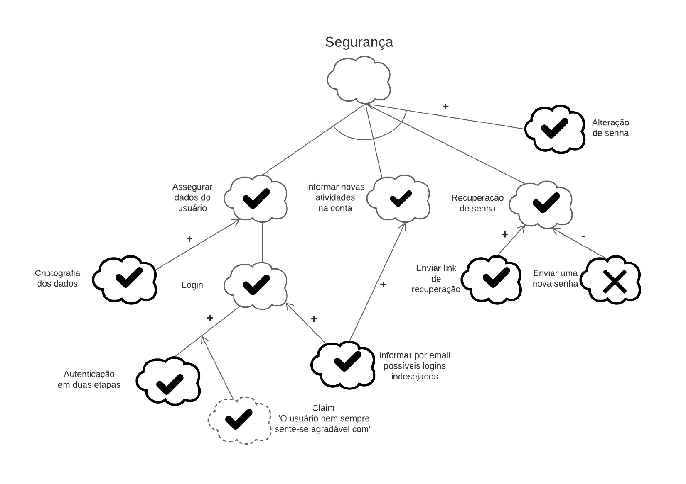
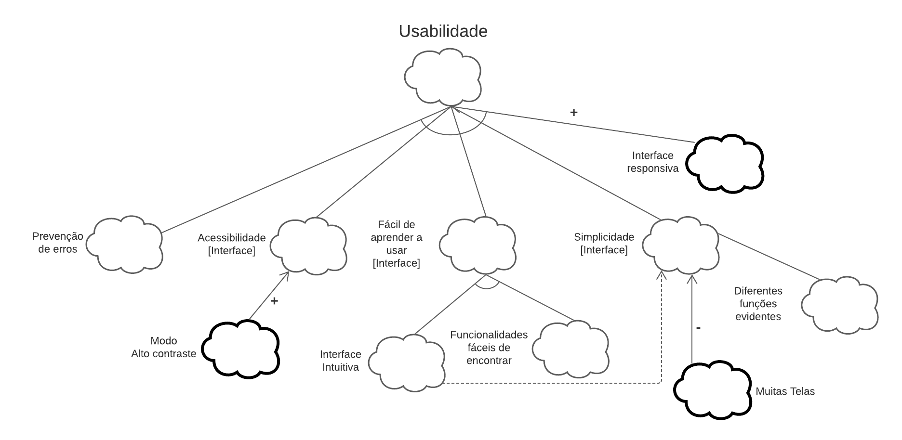
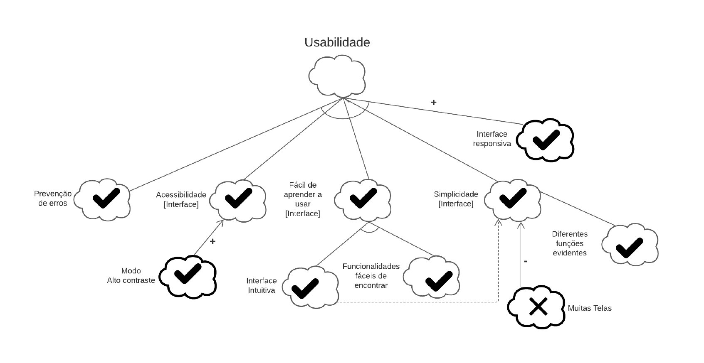
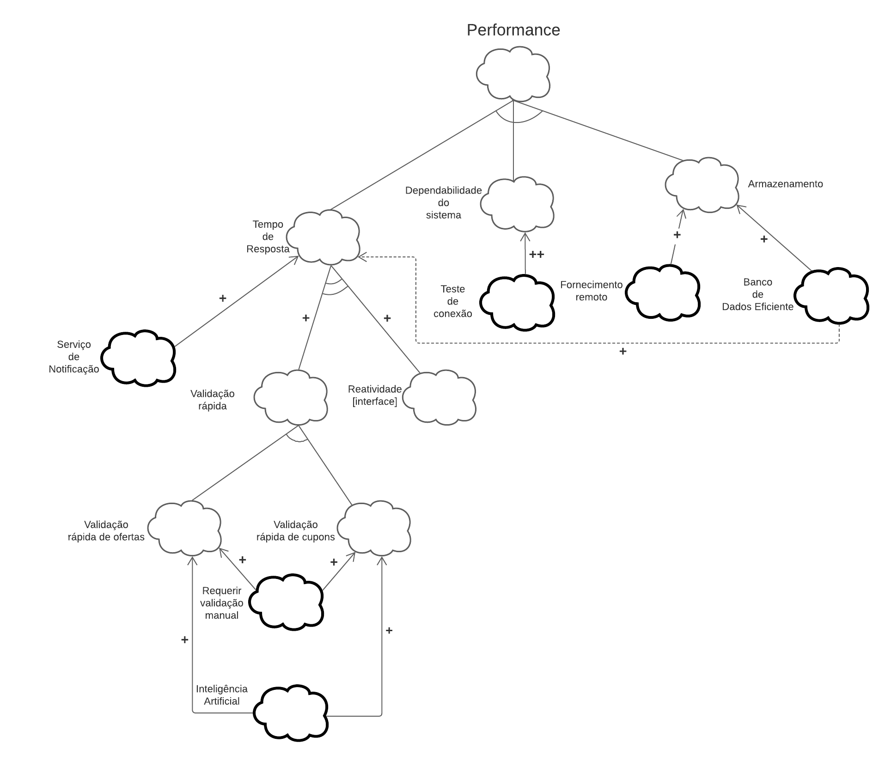
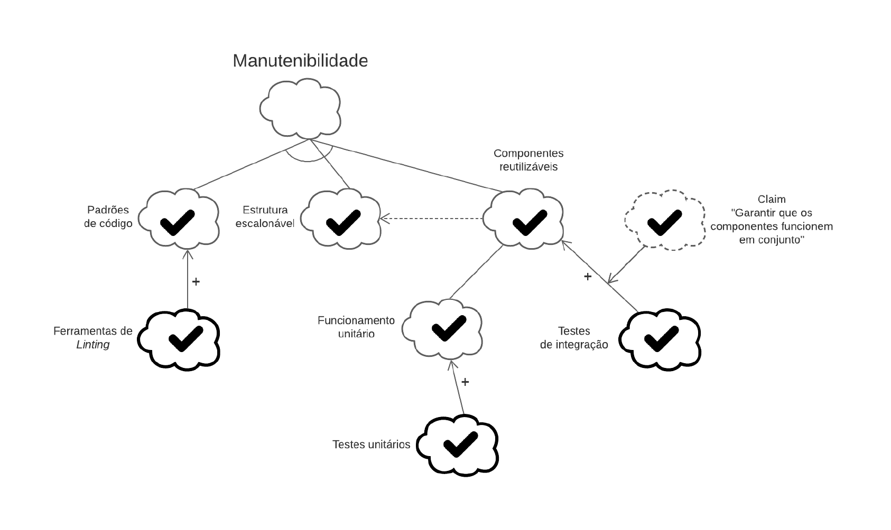
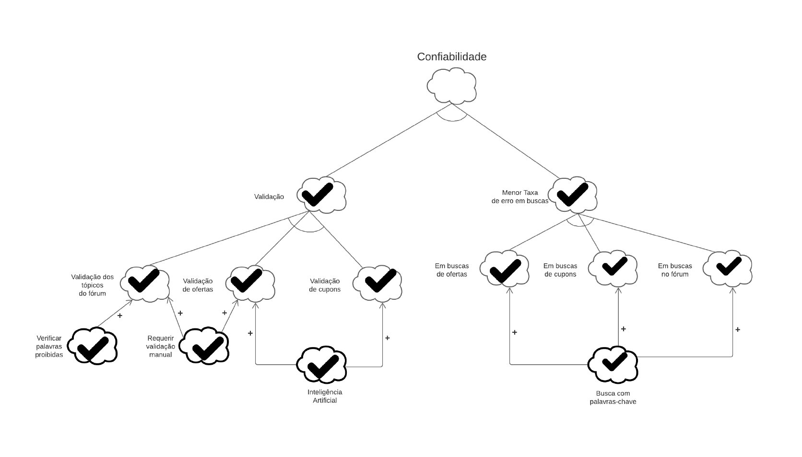
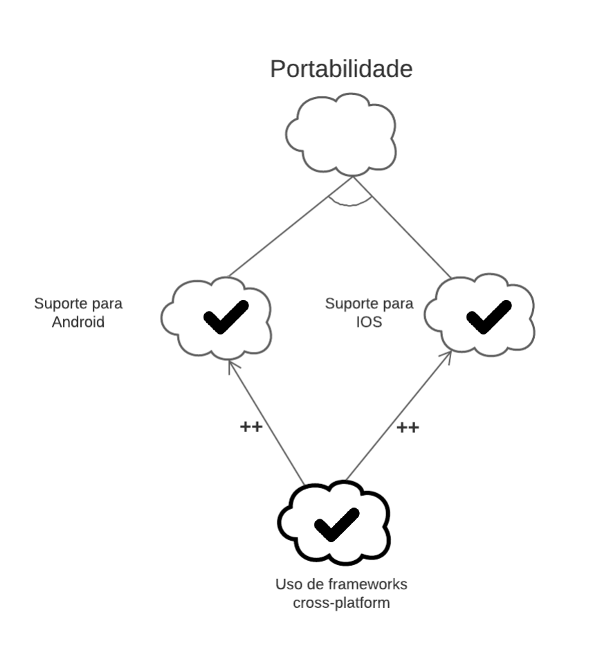
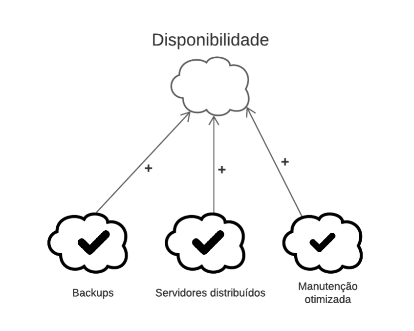

# NFR Framework

## Introdução

"O NFR Framework é uma abordagem para representar e analisar Requisitos Não-Funcionais. Seu objetivo é ajudar desenvolvedores na implementação de soluções personalizadas, levando em consideração as características do domínio e do sistema em questão. Tais características incluem Requisitos Não-funcionais, Requisitos funcionais, prioridades e carga de trabalho. Esses fatores determinam a escolha de alternativas de desenvolvimento para um determinado sistema (CHUNG et al., 2000)" (SILVA, 2019, p. 30).

## Non-Functional-Requirements (NFR)

### NFRF01: Segurança

<a target="_blank" href="https://drive.google.com/file/d/1J6RBl-wC7CLMkTMY91mW-YDrGyY3HR-f/view?usp=sharing">Link para o diagrama acima</a>

#### Propagação

<a target="_blank" href="https://drive.google.com/file/d/1xx7kCUSKzjsyYrym11D7lKkvfV2dj2Ed/view?usp=sharing">Link para o diagrama acima</a>

### NFRF02: Usabilidade

<a target="_blank" href="https://drive.google.com/file/d/13VC9YcmCZrAYrbhJOvkyLHtTxXWVxYX_/view?usp=sharing">Link para o diagrama acima</a>

#### Propagação

<a target="_blank" href="https://drive.google.com/file/d/1vTff-KaTYcQwHALNokWesxKqMuFcAp3-/view?usp=sharing">Link para o diagrama acima</a>

### NFRF03: Performance

<a target="_blank" href="https://drive.google.com/file/d/1RC26J6CAjR6LHPda911ydGsrL_oPA-hN/view?usp=sharing">Link para o diagrama acima</a>

#### Propagação

<a target="_blank" href="https://drive.google.com/file/d/1QSKeW27wmbd1107H007y4dxb8VclI4JJ/view?usp=sharing">Link para o diagrama acima</a>

### NFRF04: Manutenibilidade

<a target="_blank" href="https://drive.google.com/file/d/1JnBFCivc1qilXlacmVW5V1bvYiFbSkMf/view?usp=sharing">Link para o diagrama acima</a>

#### Propagação

<a target="_blank" href="https://drive.google.com/file/d/1WEQGzwVrGuZjD0ati1zOrsRPr6EcAP4r/view?usp=sharing">Link para o diagrama acima</a>

### NFRF05: Confiabilidade

<a target="_blank" href="https://drive.google.com/file/d/1XJBaXNbK95l0oA8lOVJCj_NcVWVj7776/view?usp=sharing">Link para o diagrama acima</a>

#### Propagação

<a target="_blank" href="https://drive.google.com/file/d/1ZhpfJ6yG6ey2_LWZ8tublWli4Vm9Gfds/view?usp=sharing">Link para o diagrama acima</a>

### NFRF06: Portabilidade

<a target="_blank" href="https://drive.google.com/file/d/1HNwoe11CxEr8zMn7jLtGfOLyyUxG1uDG/view?usp=sharing">Link para o diagrama acima</a>

#### Propagação

<a target="_blank" href="https://drive.google.com/file/d/1CFbSGVwxsCWHxndWpqoIyT2UPOoEnfG1/view?usp=sharing">Link para o diagrama acima</a>

### NFRF07: Disponibilidade

<a target="_blank" href="https://drive.google.com/file/d/1LPbGeLXMi3zSWu9J-YH4-SDGxJSjYZPM/view?usp=sharing">Link para o diagrama acima</a>

### Propagação

<a target="_blank" href="https://drive.google.com/file/d/1E-tE8mrPZeb1pJxAzgqK9RTg8UG_3xCt/view?usp=sharing">Link para o diagrama acima</a>

## Referências Bibliográficas

>CHUNG, Lawrence; NIXON, Brian. Nixon, YU, Eric; MYLOPOULOS, John. "Non-Functional Requirements in Software Engineering". Springer US, 2000.

> SILVA, Reinaldo Antônio da. NFR4ES: Um Catálogo de Requisitos Não-Funcionais para Sistemas Embarcados. 2019

>Requisitos Não-Funcionais. UFPE. Disponível em: https://www.cin.ufpe.br/~if716/arquivos20152/experimentoBruno/Aula2/Aula2-Parte2-NFR%20Framework.pdf. Acesso em: 16 de out. de 2020.

>NFR Framework. Disponível em: http://jaejaneiro.orgfree.com/engsofnfr.pdf. Acesso em: 16 de out. de 2020.

## Versionamento
| Versão | Data | Modificação | Autor |
|--|--|--|--|
| 1.0 | 16/10/2020 | Criação do documento | Todos os integrantes |
