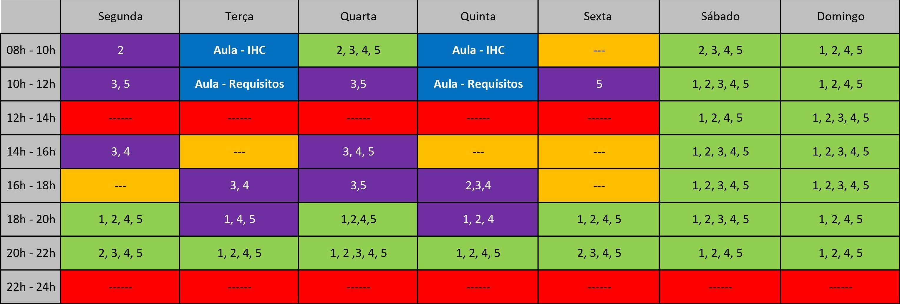
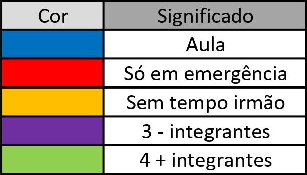

# Planejamento

## 1. Introdução

&nbsp;&nbsp;Este documento apresenta o planejamento do projeto, descreveremos aqui as etapas de desenvolvimento. Será dividido em cinco partes: introdução, cronogramas, metodologia, equipe, ferramentas utilizadas e referência bibliográfica.

 

## 2. Cronogramas

&nbsp;&nbsp;Tendo em vista os prazos estipulados pela disciplina, a equipe organizou um planejamento inicial de modo a atender às exigências de cada ponto de controle. É importante destacar que as datas podem ser alteradas futuramente

### 2.1 Etapas

|Phases|Título|Data|Descrição|
|:--------:|:------:|:-----------------------------:|:----------------------------------:|
|I| Pré-Rastreabilidade    | 02/09 - 07/09  | Planejamento do projeto e RichPicture|
|II|  Elicitação de Requisitos   | 08/09 - 15/09  | Técnicas e Priorização|
|III| Modelagem de Requisitos - Inicial   | 16/09 - 23/09  | Cenários - Léxico  |
|III| Modelagem de Requisitos - Tradicional   | 24/09 - 09/10  | Use Case - Especificação Suplementar|
|III|  Modelagem de Requisitos Ágil     | 10/10 - 17/10 | Histórias de Usuários - Backlogs |
|III| Modelagem de Requisitos - Intencional ou Orientada à Meta |18/10 - 28/10 |NFR Framework |
|IV|  Análise de Requisitos    |  29/10 - 09/11|Verificação - Validação   |
|V|   Gerência de Desenvolvimento de Software orientada à baseline de Requisitos  | 10/11 - 25/11  |    Pós-Rastreabilidade   |
 

## 3. Metodologia:

###  eXtreme Programming (XP):

&nbsp;&nbsp;É uma metodologia leve para times de tamanho pequeno e médio que utiliza quatro valores (comunicação, simplicidade, feedback e coragem). Será adotado o pareamento entre os membros da equipe, vizando homogeneização do conhecimento.

 

## 4. Equipe

### Horários disponíveis dos integrantes

&nbsp;&nbsp;A tabela abaixo representa os horários disponiveis do integrantes do grupo, com intuito de gerenciar pareamentos e reuniões presenciais ou por videoconferência (utilizando o Google Hangouts)

 
  
  

    
    
  

Tabela horários disponível [**aqui**](https://unbbr-my.sharepoint.com/:x:/g/personal/180018728_aluno_unb_br/EQdxh2LVMcBFisw_7OY68R0BNMp7wD1DMw01AS471TkVoQ?e=XIeJQP)
  

## 5. Ferramentas Utilizadas

| Ferramenta | Nome | Descrição |
|:--:|:--:|:--:|
|  | [Promobit](https://www.promobit.com.br/) | O Promobit reúne oportunidades de compras com desconto com participação ativa dos usuários |
|  | [Discord](https://discordapp.com) | Plataforma de comunicação para chamadas de áudio e vídeo |
|  | [GitHub](https://github.com) | Plataforma de versionamento em que iremos armazenar todos os arquivos relacionados ao projeto |
|  | [Lucidchart](www.lucidchart.com) | Ferramenta CASE |
|  | [Office 365](www.office.com) | Versão online do Microsoft Office 365 |
|  | [Telegram](https://web.telegram.org) | Ferramenta de comunicação rápida entre os integrantes |
|  | [ZenHub](https://www.zenhub.com) | Subsistema no GitHub que permite gestão ágil do projeto/grupo com interface KanBan |

 

## 6. Referências Bibliográficas

>Integrando XP as principais metodologias ágeis, disponível em: https://www.devmedia.com.br/integrando-xp-as-principais-metodologias-ageis/30989

 

## Versionamento
| Versão | Data | Modificação | Autor |
|--|--|--|--|
| 1.0 | 02/09/2020 | Criação documento de planejamento | Todos os integrantes |
| 1.1 | 02/09/2020 | Pequenas alterações gerais no documento | Thiago Lopes |