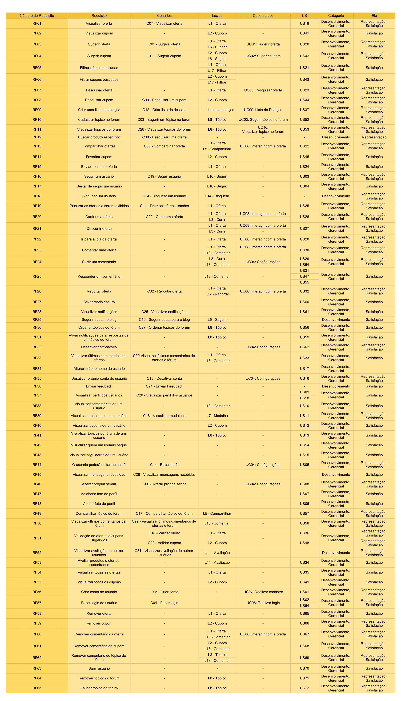

# Matriz Foward-from

## Introdução

Nós decidimos utilizar o meta-modelo de Toranzo.

## Legenda

### Classificação

**Ambiental:** congrega informações oriundas do contexto ambiental onde a organização está inserida e que podem afetar o sistema sendo desenvolvido;

**Organizacional:** reune informações relacionadas à organização (missão, objetivos, metas e padrões) e que podem impactar os requisitos do sistema;

**Gerencial:** agrega informações que permitem associar tarefas a requisitos, e que podem auxiliar a gerência do projeto;

**Desenvolvimento:** abarca informações relacionadas aos diversos artefatos gerados no processo de desen volvimento;

### Elos

**Satisfação:** indica que a classe de origem tem dependência de satisfação com classe de destino;

**Recurso:** indica que a classe de origem tem dependência de recurso com clas se de destino;
s
**Responsabilidade:** registra a participação, responsabilidade e ação de pessoas sobre artefatos;

**Representação:** captura a representação ou modelagem dos requisitos em ou tras linguagens;

**Alocado:** classe de origem está relacionada à classe de destino, que representa um subsistema;

**Agregação:** indica composição de elementos.

## Matrizes

A planilha completa pode ser acessada 
<a href="https://docs.google.com/spreadsheets/d/1o2WvzhIo65H796_G4KhsNTbO-_k17VZTx4fiC7GU7Dw/edit?usp=sharing" target="_blank">aqui</a>

## Requisitos funcionais

<a href="https://drive.google.com/file/d/1Zwr_1wY0tHGqLvjlvcU7nNsBCbfaPPyL/view?usp=sharing" target="_blank">Link para a imagem acima</a>

## Requisitos não funcionais

<a href="https://drive.google.com/file/d/1qTjbc59aX-YJFh2m2g0u2wMUtMsLabLq/view?usp=sharing" target="_blank">Link para a imagem acima</a>

## Referência

>Sayão, M., & do Prado Leite, J. C. S. (2006). Rastreabilidade de requisitos. RITA, 13(1), 57-86.
>Toranzo, M., Castro, J., & Mello, E. (2002, November). Uma Proposta para Melhorar o Rastreamento de Requisitos. In WER (pp. 194-209).

## Versionamento

| Versão | Data | Modificação | Autor |
|--|--|--|--|
| 1.0 | 22/11/2020 | Criação do documento | Igor, Marcelo, Rhuan, Thiago Lopes |
