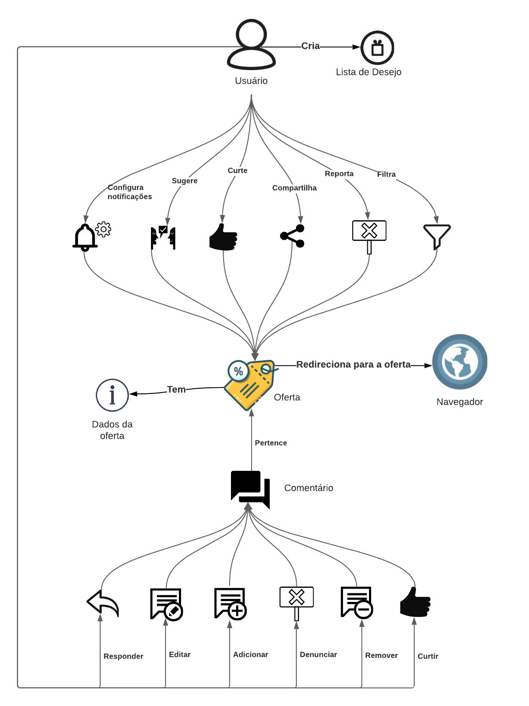
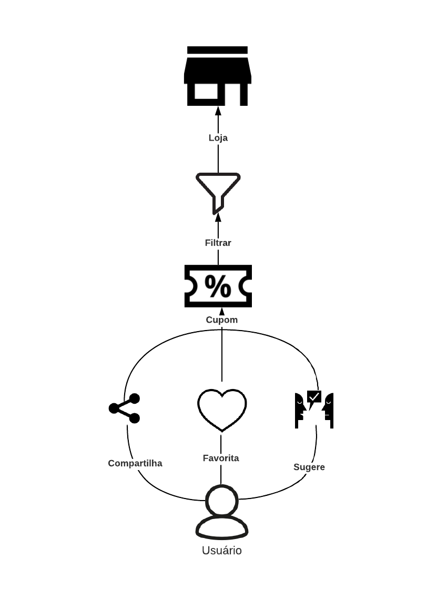
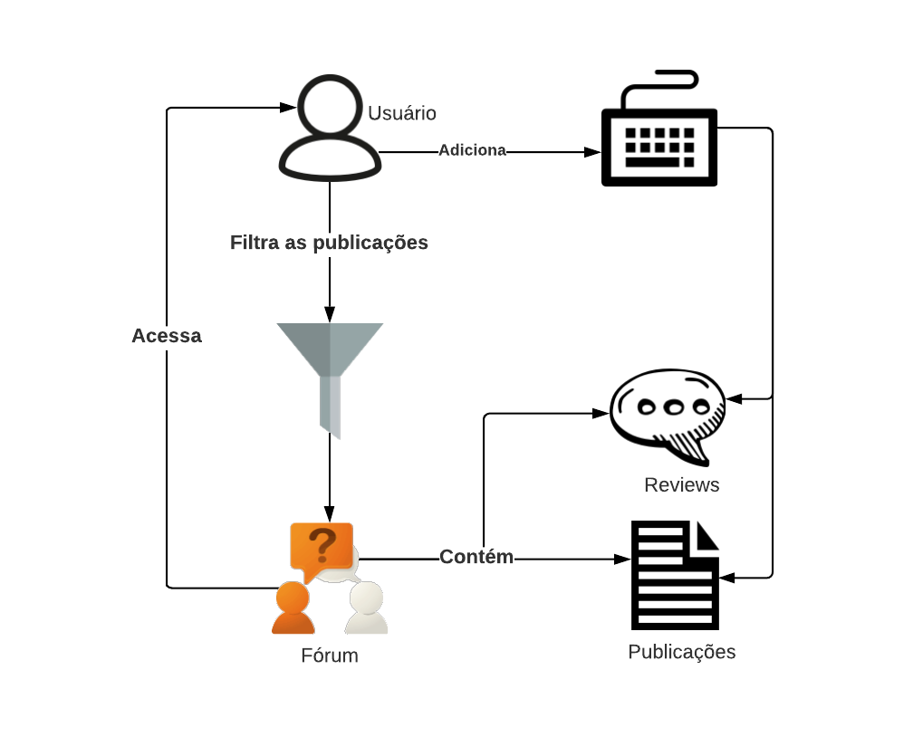

# Rich Picture

## Introdução

&nbsp;&nbsp;Rich picture é uma maneira de explorar, reconhecer e definir uma situação e expressá-la através de diagramas, para criar um modelo mental preliminar. Ajuda na discussão e a chegar em um entendimento amplo e compartilhado de uma situação.

## RP1 - Geral

  

## RP2 - Ofertas

  

## RP3 - Cupons

  

## RP4 - Usuarios

  

## RP5 - Fórum

  

## RP6 - Configuração

  

 

## Referências Bibliográficas

>Rich Pictures. BetterEvaluation. Disponível em: https://www.betterevaluation.org/en/evaluation-options/richpictures, acesso em: 15 de out. de 2020.

## Versionamento
| Versão | Data | Modificação | Autor |
|--|--|--|--|
| 1.0 | 05/09/2020 | Criação dos rich pictures | Todos os integrantes |
| 1.1 | 13/09/2020 | Criação do documento de rich pictures | Igor e Marcelo |
